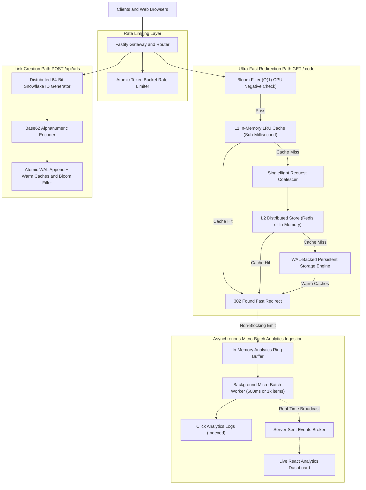

# FlashRoute — High-Throughput Systems Architecture Document

## 1. Executive Summary

FlashRoute is a distributed, high-throughput URL shortening and real-time click analytics gateway. Built with systems engineering first principles, it is specifically designed to achieve sub-millisecond p99 read latencies, handle extreme concurrent traffic spikes without database degradation, and ingest analytics asynchronously without blocking HTTP redirection paths.

---

## 2. System Architecture Diagram



---

## 3. Deep-Dive: Core Systems Principles & Algorithms

### 3.1. Distributed 64-Bit Snowflake ID Generator & Base62 Encoding
* **The Problem:** Traditional URL shorteners rely on database `AUTO_INCREMENT` primary keys (which create a single point of failure and bottleneck write throughput) or random UUIDs (which are 36 characters long and cause severe B-Tree index page fragmentation).
* **The Solution:** FlashRoute generates 64-bit integer IDs using bitwise arithmetic in application memory:
  ```
  +-------------------------------------------------------------------------+
  | 1 bit (0) | 41 bits Timestamp (ms) | 10 bits Worker ID | 12 bits Sequence |
  +-------------------------------------------------------------------------+
  ```
  - **41-bit Timestamp:** Provides ~69 years of millisecond precision from a custom epoch (`2026-01-01`).
  - **10-bit Worker ID:** Supports up to 1,024 distributed worker nodes without ID collisions.
  - **12-bit Sequence:** Allows generating up to 4,096 unique IDs per millisecond per worker node (**4,096,000 IDs/sec throughput**).
  - **Base62 Encoding:** Maps the resulting 64-bit integer to a 7-8 character URL-safe string `[0-9a-zA-Z]`.

---

### 3.2. Two-Tier Caching Hierarchy (L1 LRU + L2 Shared Store)
* **L1 In-Memory LRU Cache:** Uses a Doubly-Linked List + Hash Map to provide true $O(1)$ reads, writes, and evictions in memory with `< 0.05ms` lookup latency.
* **L2 Shared Cache:** Distributed Redis client (or in-memory cluster simulator) with jittered TTL (8–12 minutes) to prevent simultaneous cache expiration waves (cache avalanches).

---

### 3.3. Thundering Herd / Cache Stampede Defense via Singleflight
* **The Problem:** When an ultra-popular link expires from cache, or a cold link suddenly receives 5,000 concurrent requests, all 5,000 requests simultaneously miss the cache and hit the database in parallel, causing database CPU spikes and connection exhaustion.
* **The Solution:** FlashRoute's `SingleflightGroup` deduplicates concurrent in-flight executions for identical keys:
  - Request 1 arrives ➔ Starts the async database query.
  - Requests 2 through 5,000 arrive ➔ Hook onto the existing in-flight Promise without issuing new DB queries.
  - The query finishes ➔ All 5,000 requests receive the result simultaneously with **exactly 1 database hit**.

---

### 3.4. Cache Penetration Defense via In-Memory Bloom Filter
* **The Problem:** Malicious actors or scrapers querying millions of random non-existent short codes (e.g. `GET /badKey999`) bypass standard caches and force continuous database disk reads.
* **The Solution:** An in-memory BitSet Bloom filter with Kirsch-Mitzenmacher double-hashing rejects non-existent keys in $O(1)$ CPU cycles before any cache or storage lookup is executed.

---

### 3.5. Atomic Token Bucket Rate Limiting
* **The Algorithm:** Implements continuous monotonic refill:
  $$\text{tokens} = \min(\text{capacity}, \text{tokens} + \Delta t \times \text{refillRate})$$
* **Burst Handling:** Allows legitimate users to perform burst requests up to the bucket capacity while strictly throttling abusive sustained traffic.
* **Standard Response Headers:**
  - `X-RateLimit-Limit`: Maximum bucket capacity.
  - `X-RateLimit-Remaining`: Remaining token balance.
  - `X-RateLimit-Reset`: Milliseconds until complete bucket refill.
  - `Retry-After`: Seconds to wait when receiving `429 Too Many Requests`.

---

### 3.6. Non-Blocking Asynchronous Micro-Batch Analytics
* **The Problem:** Extracting client IP hashes, parsing user-agents, resolving geolocation, and inserting rows into analytics tables takes 5–20ms. Waiting for this on the redirection path degrades redirect speeds.
* **The Solution:**
  1. The redirect handler creates the click event and pushes it to an in-memory ring buffer in `< 0.02ms`.
  2. The handler immediately returns `302 Found`.
  3. A background batch worker flushes accumulated events every 500ms or 1,000 records using bulk batch writes to disk.
  4. Real-time updates are streamed live to connected dashboard clients via Server-Sent Events (SSE).

---

### 3.7. Write-Ahead Log (WAL) Storage Engine
* **Durability:** All link creations and click batches are sequentially appended to `data/flashroute.wal`.
* **In-Memory Hash Indexing:** $O(1)$ lookups for URLs and clicks.
* **Automatic Checkpointing:** Compresses the WAL into `data/snapshot.json` every 5,000 writes and reclaims disk space.
* **Crash Recovery:** Replays snapshot + active WAL upon boot in `< 5ms`.
